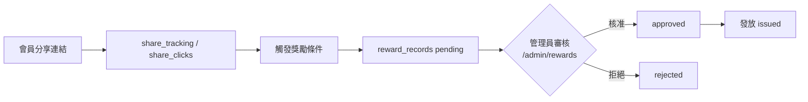
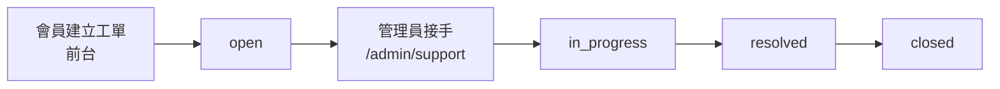

# 門市團購 APP — 後台管理系統指南

本文件說明後台管理介面的功能、權限、操作流程與相關 API／資料表，供管理員與門市人員使用。

---

## 後台系統總覽

### 存取網址

| 項目 | 說明 |
|------|------|
| 後台首頁 | `https://<你的網域>/admin` |
| 登入頁 | `https://<你的網域>/auth/login` |
| 本機開發 | `http://localhost:3000/admin` |

未登入使用者造訪 `/admin` 會自動導向 `/auth/login`。登入後若 `profiles.role` 不是 `admin` 或 `store_staff`，會被導回首頁。

### 角色說明

| 角色 | 代碼 | 說明 |
|------|------|------|
| 系統管理員 | `admin` | 可存取所有後台模組與設定 |
| 門市人員 | `store_staff` | 僅可處理訂單、付款、取貨與儀表板 |
| 一般會員 | `member` | 無法進入後台（前台購物） |
| 團購主 | `group_leader` | 前台角色，可管理自己的團購（非後台） |
| 推廣員 | `promoter` | 前台分潤相關（非後台） |
| 直播主 | `livestream_host` | 前台直播管理（非後台） |

權限由 `profiles.role` 欄位控制，並由 `src/middleware.ts` 與各 API 的 `requireAdmin` / `requireStaffOrAdmin` 雙重驗證。

### 設定管理員：`npm run set-admin`

在專案根目錄執行：

```bash
npm run set-admin
```

**前置條件：**

1. `.env.local` 已設定 `NEXT_PUBLIC_SUPABASE_URL` 與 `SUPABASE_SERVICE_ROLE_KEY`
2. 目標帳號已在 Supabase Auth 註冊（觸發器會自動建立 `profiles`）

**行為：**

- 預設將 `ADMIN_EMAIL` 環境變數指定的 Email 設為 `admin`（未設定時為 `aa85002318@gmail.com`）
- 透過 Service Role 對 `profiles` 執行 upsert，寫入 `role: "admin"`

亦可直接在 Supabase SQL Editor 執行：

```sql
UPDATE profiles SET role = 'admin' WHERE email = '你的@email.com';
```

---

## 完整功能清單（17 個模組）

以下依側邊欄順序說明。`/admin/push` 會自動重新導向至 `/admin/notifications`，視為同一推播模組的別名路徑。

---

### 1. 儀表板 `/admin`

| 項目 | 內容 |
|------|------|
| **用途** | 即時營運 KPI 總覽與快速操作入口 |
| **可存取** | `admin`、`store_staff` |
| **主要功能** | 今日訂單／銷售額、待付款、待確認付款、待取貨、新會員、分享訂單、待審核獎勵／分潤、本月分潤總額、影音／直播觀看次數 |
| **API** | `GET /api/admin/dashboard` |
| **資料表** | `orders`、`profiles`、`reward_records`、`commission_records`、`videos`、`livestreams` |

---

### 2. 商品管理 `/admin/products`

| 項目 | 內容 |
|------|------|
| **用途** | 商品目錄 CRUD、上下架、分類關聯 |
| **可存取** | 僅 `admin` |
| **主要功能** | 搜尋商品名稱、新增／編輯（名稱、價格、庫存、分類、描述、啟用狀態）、分頁列表 |
| **API** | `GET/POST/PUT /api/admin/products`、`GET/POST /api/admin/categories` |
| **資料表** | `products`、`product_categories` |

---

### 3. 團購管理 `/admin/group-buy`

| 項目 | 內容 |
|------|------|
| **用途** | 團購活動建立與狀態管理 |
| **可存取** | 僅 `admin` |
| **主要功能** | 新增團購（標題、說明、起迄時間）、狀態切換（`draft` → `active` → `ended`）、搜尋；活動 `banner_url` 會出現在前台首頁輪播 |
| **API** | `GET/POST /api/admin/group-buy-events`、`PATCH/DELETE /api/admin/group-buy-events/[id]` |
| **資料表** | `group_buy_events`、`group_buy_products`、`stores` |

---

### 4. 訂單管理 `/admin/orders`

| 項目 | 內容 |
|------|------|
| **用途** | 訂單查詢、狀態更新、匯出 |
| **可存取** | `admin`、`store_staff` |
| **主要功能** | 依訂單編號搜尋、狀態篩選、手動更新訂單狀態、匯出 Excel |
| **API** | `GET /api/admin/orders`、`PATCH /api/orders/[id]/status`、`GET /api/admin/orders/export?format=xlsx` |
| **資料表** | `orders`、`order_items`、`profiles` |

---

### 5. 付款審核 `/admin/payments`

| 項目 | 內容 |
|------|------|
| **用途** | 審核會員銀行轉帳付款回報 |
| **可存取** | `admin`、`store_staff` |
| **主要功能** | 檢視金額、轉帳後五碼、付款方式；**確認**或**拒絕**待審核回報 |
| **API** | `GET /api/payment-reports`、`PATCH /api/payment-reports/[id]/confirm` |
| **資料表** | `payment_reports`、`orders` |

確認付款後，訂單狀態自動更新為 `payment_confirmed`。

---

### 6. 取貨管理 `/admin/pickup`

| 項目 | 內容 |
|------|------|
| **用途** | 待取貨訂單清單與取貨確認 |
| **可存取** | `admin`、`store_staff` |
| **主要功能** | 列出 `ready_for_pickup` 訂單、搜尋、**確認取貨**（寫入取貨紀錄並完成訂單） |
| **API** | `GET/POST /api/admin/pickup` |
| **資料表** | `orders`、`pickup_records`、`profiles`、`stores` |

---

### 7. 影音管理 `/admin/videos`

| 項目 | 內容 |
|------|------|
| **用途** | 教學／行銷影片管理 |
| **可存取** | 僅 `admin` |
| **主要功能** | 新增影片（標題、URL、描述）、啟用／停用、搜尋、刪除 |
| **API** | `GET/POST /api/admin/videos`、`PATCH/DELETE /api/admin/videos/[id]` |
| **資料表** | `videos`、`products`（可選關聯） |

---

### 8. 直播管理 `/admin/livestreams`

| 項目 | 內容 |
|------|------|
| **用途** | 直播場次排程與狀態管理 |
| **可存取** | 僅 `admin` |
| **主要功能** | 新增直播、設定串流 URL、排程時間、狀態（`scheduled` / `live` / `ended`）、刪除 |
| **API** | `GET/POST /api/admin/livestreams`、`PATCH/DELETE /api/admin/livestreams/[id]` |
| **資料表** | `livestreams`、`livestream_products`、`profiles` |

---

### 9. 推播通知 `/admin/notifications`（`/admin/push` 導向此頁）

| 項目 | 內容 |
|------|------|
| **用途** | 發送站內推播給指定角色會員 |
| **可存取** | 僅 `admin` |
| **主要功能** | 撰寫標題與內文、選擇目標角色、發送、檢視歷史紀錄 |
| **API** | `POST /api/push-notifications`、`GET /api/admin/push-notifications` |
| **資料表** | `push_notifications`、`user_notifications` |

---

### 10. 會員管理 `/admin/members`

| 項目 | 內容 |
|------|------|
| **用途** | 會員列表、角色指派、購物金調整 |
| **可存取** | 僅 `admin` |
| **主要功能** | 搜尋（Email、姓名、會員碼）、編輯角色、調整 `store_credit_balance`（儲值金） |
| **API** | `GET /api/admin/members`、`PATCH /api/admin/members/[id]` |
| **資料表** | `profiles` |

---

### 11. 分享追蹤 `/admin/share-tracking`

| 項目 | 內容 |
|------|------|
| **用途** | 分享連結點擊與註冊轉換分析 |
| **可存取** | 僅 `admin` |
| **主要功能** | 總連結數、總點擊、總註冊轉換；各分享者明細列表 |
| **API** | `GET /api/admin/share-tracking` |
| **資料表** | `share_tracking`、`share_clicks`、`profiles` |

---

### 12. 獎勵管理 `/admin/rewards`

| 項目 | 內容 |
|------|------|
| **用途** | 分享獎勵審核與發放 |
| **可存取** | 僅 `admin` |
| **主要功能** | 列出獎勵紀錄、**核准**／**拒絕**／**發放**（狀態：`pending` → `approved` → `issued`） |
| **API** | `GET /api/admin/rewards`、`PATCH /api/admin/rewards/[id]/approve`、`/reject`、`/issue` |
| **資料表** | `reward_records`、`profiles` |

---

### 13. 分潤規則 `/admin/commission-rules`

| 項目 | 內容 |
|------|------|
| **用途** | 分潤計算規則設定 |
| **可存取** | 僅 `admin` |
| **主要功能** | 新增規則（百分比、固定金額、對象角色、計算基礎、優先順序）、啟用／停用、編輯、刪除 |
| **API** | `GET/POST /api/admin/commission-rules`、`PATCH/DELETE /api/admin/commission-rules/[id]` |
| **資料表** | `commission_rules` |

---

### 14. 分潤紀錄 `/admin/commission-records`

| 項目 | 內容 |
|------|------|
| **用途** | 分潤計算結果審核、發放、追回 |
| **可存取** | 僅 `admin` |
| **主要功能** | 單筆／批次核准、拒絕、發放（現金／儲值金等）、手動建立、匯出 Excel、追回（clawback） |
| **API** | `GET /api/admin/commission-records`、`PATCH .../approve`、`/reject`、`/issue`、`POST .../batch`、`POST .../manual`、`PATCH .../clawback`、`GET .../export` |
| **資料表** | `commission_records`、`commission_rules`、`orders`、`commission_payouts`、`commission_payout_items` |

---

### 15. 客服工單 `/admin/support`

| 項目 | 內容 |
|------|------|
| **用途** | 會員客服問題處理 |
| **可存取** | 僅 `admin` |
| **主要功能** | 工單列表、優先級檢視、狀態更新（`open` → `in_progress` → `resolved` → `closed`） |
| **API** | `GET /api/admin/support-tickets`、`PATCH /api/admin/support-tickets/[id]` |
| **資料表** | `support_tickets`、`support_conversations`、`support_messages`、`orders` |

---

### 16. 報表中心 `/admin/reports`

| 項目 | 內容 |
|------|------|
| **用途** | 下載營運 Excel 報表 |
| **可存取** | 僅 `admin` |
| **主要功能** | 訂單報表、分潤報表下載連結 |
| **API** | `GET /api/admin/orders/export?format=xlsx`、`GET /api/admin/commission-records/export?format=xlsx` |
| **資料表** | `orders`、`commission_records`（匯出用） |

---

### 17. 推播別名路徑 `/admin/push`

| 項目 | 內容 |
|------|------|
| **用途** | 與模組 9 相同，伺服器端 `redirect` 至 `/admin/notifications` |
| **可存取** | 僅 `admin`（middleware 會攔截 `store_staff`） |
| **主要功能** | —（請使用 `/admin/notifications`） |
| **API** | 同模組 9 |
| **資料表** | 同模組 9 |

---

## 操作流程

### 主流程：商品上架 → 開團 → 訂單 → 付款 → 取貨 → 分潤

```mermaid
flowchart LR
  A[商品上架<br>/admin/products] --> B[建立團購<br>/admin/group-buy]
  B --> C[會員下單<br>前台]
  C --> D[訂單 awaiting_payment<br>/admin/orders]
  D --> E[會員回報付款<br>前台]
  E --> F[付款審核<br>/admin/payments]
  F --> G[訂單 payment_confirmed]
  G --> H[備貨 preparing]
  H --> I[待取貨 ready_for_pickup<br>/admin/pickup]
  I --> J[取貨完成 completed]
  J --> K[分潤計算與審核<br>/admin/commission-records]
```



**步驟說明：**

1. **商品上架**：在商品管理新增商品、設定分類與庫存，確認 `is_active = true`。
2. **開團**：在團購管理建立活動、設定 `banner_url`（首頁輪播）、將狀態改為 `active`，並在 `group_buy_products` 設定團購價（可透過 API 或種子資料）。
3. **訂單處理**：會員下單後訂單為 `awaiting_payment`；可在訂單管理檢視與手動推進狀態。
4. **付款確認**：會員提交付款回報（`payment_reported`）後，門市人員或管理員在付款審核**確認**；系統將訂單改為 `payment_confirmed`。
5. **備貨與待取貨**：將訂單更新為 `preparing` → `ready_for_pickup`。
6. **取貨**：在取貨管理點擊**確認取貨**，寫入 `pickup_records`，訂單完成。
7. **分潤審核**：訂單完成後系統依 `commission_rules` 產生 `commission_records`；管理員在分潤紀錄**核准** → **發放**。

### 分享獎勵審核流程



管理員在獎勵管理對 `pending` 紀錄執行核准或拒絕；核准後可執行發放。分享成效可在分享追蹤頁面檢視點擊與註冊數。

### 客服工單處理



會員亦可透過即時對話（`support_conversations` / `support_messages`）與機器人／客服互動；正式工單在後台統一追蹤狀態與優先級。

---

## 權限矩陣

| 模組 | 路徑 | admin | store_staff |
|------|------|:-----:|:-----------:|
| 儀表板 | `/admin` | ✅ | ✅ |
| 商品 | `/admin/products` | ✅ | ❌ |
| 團購 | `/admin/group-buy` | ✅ | ❌ |
| 訂單 | `/admin/orders` | ✅ | ✅ |
| 付款 | `/admin/payments` | ✅ | ✅ |
| 取貨 | `/admin/pickup` | ✅ | ✅ |
| 影音 | `/admin/videos` | ✅ | ❌ |
| 直播 | `/admin/livestreams` | ✅ | ❌ |
| 推播 | `/admin/notifications` | ✅ | ❌ |
| 會員 | `/admin/members` | ✅ | ❌ |
| 分享追蹤 | `/admin/share-tracking` | ✅ | ❌ |
| 獎勵 | `/admin/rewards` | ✅ | ❌ |
| 分潤規則 | `/admin/commission-rules` | ✅ | ❌ |
| 分潤紀錄 | `/admin/commission-records` | ✅ | ❌ |
| 客服 | `/admin/support` | ✅ | ❌ |
| 報表 | `/admin/reports` | ✅ | ❌ |
| 推播別名 | `/admin/push` | ✅ | ❌ |

`store_staff` 若直接造訪受限路徑，middleware 會導回 `/admin` 儀表板。

---

## 相關文件

- 資料庫安裝與管理員 SQL：[`supabase/README-SQL.md`](../supabase/README-SQL.md)
- 完整 Schema：[`supabase/complete-schema.sql`](../supabase/complete-schema.sql)
- 種子資料：[`supabase/seed-data.sql`](../supabase/seed-data.sql)
