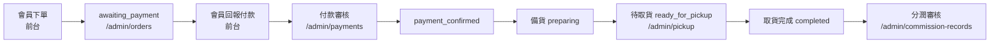

# 後台管理建立流程（從零開始）

本文件說明如何從全新環境建立門市團購 APP 的後台管理系統，涵蓋資料庫、環境變數、管理員帳號、後台初始設定與日常營運。操作細節可搭配 [`ADMIN-GUIDE.md`](./ADMIN-GUIDE.md)（功能說明）與 [`supabase/README-SQL.md`](../supabase/README-SQL.md)（SQL 安裝）。

---

## 流程總覽

```
資料庫 → 環境變數 → 啟動專案 → 建立管理員 → 登入後台 → 初始設定 → 日常營運
```

---

## 第一階段：資料庫

### 1. 建立 Supabase 專案

1. 前往 [Supabase Dashboard](https://supabase.com/dashboard) 並登入
2. 點擊 **New Project**，填寫專案名稱、資料庫密碼與區域
3. 等待專案建立完成（約 1–2 分鐘）
4. 進入 **Project Settings → API**，記下：
   - **Project URL** → `NEXT_PUBLIC_SUPABASE_URL`
   - **anon public** → `NEXT_PUBLIC_SUPABASE_ANON_KEY`
   - **service_role** → `SUPABASE_SERVICE_ROLE_KEY`（僅後端／腳本使用，勿公開）

### 2. 執行 complete-schema.sql（全新專案）

1. 開啟 Supabase Dashboard → **SQL Editor**
2. 複製專案中 [`supabase/complete-schema.sql`](../supabase/complete-schema.sql) 全部內容
3. 貼上並點擊 **Run**

此步驟會建立 30 張資料表、ENUM 型別、索引、觸發器、RLS 政策與 Storage 儲存桶。

> **警告：** `complete-schema.sql` 開頭含 **DROP CASCADE**，會刪除 public schema 內所有業務資料後重建。僅適用於**全新專案**或**開發環境重置**，**勿**在已有正式資料的生產環境執行。

### 3. 執行 seed-data.sql（選用）

若希望快速取得範例門市、分類、商品、團購活動等資料：

1. 開啟 [`supabase/seed-data.sql`](../supabase/seed-data.sql)
2. 複製全部內容，於 SQL Editor 貼上並 **Run**

種子資料包含：

- 3 家門市（取貨據點）
- 5 個商品分類（食品、烘焙材料、冷凍商品、生活用品、保健品）
- 範例商品、團購活動（含首頁輪播橫幅）、影音、直播、分潤規則

所有 `INSERT` 使用 `ON CONFLICT DO NOTHING`，可重複執行。

> **注意：** 種子資料**不含** `profiles`。使用者須先透過 Auth 註冊，`handle_new_user` 觸發器會自動建立 profile 與購物車。

亦可一次執行 [`supabase/ALL-IN-ONE.sql`](../supabase/ALL-IN-ONE.sql)（Schema + 種子資料合併版）。

### 4. 增量 migration（若已有舊庫）

若專案先前已建立資料庫、僅需升級結構，**勿**執行 `complete-schema.sql`，改依序在 SQL Editor 執行：

```
1. supabase/migrations/20250630000000_add_store_credit_balance.sql
2. supabase/migrations/20250630100000_sync_schema.sql
```

或使用 Supabase CLI：

```bash
supabase db push
```

---

## 第二階段：環境變數

在專案根目錄建立 `.env.local`（可複製 `.env.example`）：

```bash
cp .env.example .env.local
```

填入以下四個變數（皆來自 Supabase Dashboard → Project Settings → API）：

| 變數 | 說明 |
|------|------|
| `NEXT_PUBLIC_SUPABASE_URL` | 專案 URL |
| `NEXT_PUBLIC_SUPABASE_ANON_KEY` | anon public key（前端與 middleware 使用） |
| `SUPABASE_SERVICE_ROLE_KEY` | service_role key（`set-admin` 腳本與後端 API 使用） |
| `NEXT_PUBLIC_APP_URL` | 應用程式網址，本機開發填 `http://localhost:3000` |

範例：

```env
NEXT_PUBLIC_SUPABASE_URL=https://xxxxxxxx.supabase.co
NEXT_PUBLIC_SUPABASE_ANON_KEY=eyJhbGciOiJIUzI1NiIsInR5cCI6IkpXVCJ9...
SUPABASE_SERVICE_ROLE_KEY=eyJhbGciOiJIUzI1NiIsInR5cCI6IkpXVCJ9...
NEXT_PUBLIC_APP_URL=http://localhost:3000
```

若未設定 Supabase（或仍為 placeholder），應用程式會自動使用內建 mock 資料，方便本地預覽，但**無法**建立真實管理員或連線資料庫。

---

## 第三階段：啟動專案

```bash
npm install
npm run dev
```

開啟瀏覽器：

- 前台：[http://localhost:3000](http://localhost:3000)
- 後台：[http://localhost:3000/admin](http://localhost:3000/admin)（需先完成第四、五階段）

---

## 第四階段：建立管理員

管理員必須先存在於 Supabase Auth，並在 `profiles` 表將 `role` 設為 `admin`。

### 步驟 1：註冊帳號

1. 開啟 [http://localhost:3000/auth/register](http://localhost:3000/auth/register)
2. 填寫 Email、密碼完成註冊
3. 系統觸發器會自動在 `profiles` 建立紀錄（預設 `role = 'member'`）

### 步驟 2：提升為管理員

擇一方式執行：

**方式 A — 本機腳本（建議）**

```bash
npm run set-admin
```

預設將 `aa85002318@gmail.com` 設為管理員。若要指定其他 Email：

```bash
ADMIN_EMAIL=你的@email.com npm run set-admin
```

**前置條件：**

- `.env.local` 已設定 `NEXT_PUBLIC_SUPABASE_URL` 與 `SUPABASE_SERVICE_ROLE_KEY`
- 目標 Email 已在 `/auth/register` 完成註冊

**方式 B — Supabase SQL Editor**

```sql
UPDATE profiles SET role = 'admin' WHERE email = 'aa85002318@gmail.com';
```

將 Email 替換為你註冊的帳號。

---

## 第五階段：登入後台

1. 開啟 [http://localhost:3000/auth/login](http://localhost:3000/auth/login)
2. 以管理員帳號登入
3. 造訪 [http://localhost:3000/admin](http://localhost:3000/admin)

### Middleware 權限說明

`src/middleware.ts` 對 `/admin` 路徑執行以下檢查：

| 情境 | 行為 |
|------|------|
| 未登入 | 導向 `/auth/login` |
| 已登入但 `profiles.role` 不是 `admin` 或 `store_staff` | 導回首頁 `/` |
| `store_staff` 造訪受限路徑 | 導回 `/admin` 儀表板 |

`store_staff`（門市人員）僅可存取：

- `/admin`（儀表板）
- `/admin/orders`（訂單）
- `/admin/payments`（付款審核）
- `/admin/pickup`（取貨）

其餘模組（商品、團購、分潤、會員等）僅 `admin` 可存取。API 層另以 `requireAdmin` / `requireStaffOrAdmin` 雙重驗證。

---

## 第六階段：後台初始設定（建議依序）

完成登入後，建議依下列順序建立營運所需資料。

### 1. 門市／取貨點（stores）

目前後台**尚無**門市管理 UI，請透過 SQL 建立：

**選項 A：** 執行 `seed-data.sql`（已含 3 家範例門市）

**選項 B：** 在 SQL Editor 手動新增

```sql
INSERT INTO stores (name, address, phone, business_hours, is_active)
VALUES (
  '暖陽門市',
  '台北市大安區復興南路一段100號',
  '02-1234-5678',
  '週一至週六 09:00–21:00',
  true
);
```

門市資料用於：會員選擇取貨點、團購活動關聯門市、取貨管理顯示據點資訊。

### 2. 商品分類

**選項 A：** `seed-data.sql` 已含 5 個分類

**選項 B：** SQL Editor 新增

```sql
INSERT INTO product_categories (name, slug, sort_order, is_active)
VALUES ('食品', 'food', 1, true);
```

**選項 C：** 呼叫 API（需已登入管理員 session）

```bash
curl -X POST http://localhost:3000/api/admin/categories \
  -H "Content-Type: application/json" \
  -d '{"name":"食品","slug":"food","sort_order":1}'
```

### 3. 商品上架

路徑：**商品管理** → [`/admin/products`](http://localhost:3000/admin/products)

1. 點擊 **新增商品**
2. 填寫名稱、價格、庫存、分類、描述
3. 勾選 **上架中**（`is_active = true`）
4. 儲存

### 4. 團購活動

路徑：**團購管理** → [`/admin/group-buy`](http://localhost:3000/admin/group-buy)

1. 點擊 **新增團購**，填寫標題、說明、起迄時間
2. 建立後將狀態改為 **進行中**（`active`）
3. 若需首頁輪播橫幅，於 SQL 或 API 設定 `banner_url`：

```sql
UPDATE group_buy_events
SET banner_url = 'https://example.com/banner.jpg'
WHERE title = '你的活動標題';
```

4. 將商品加入團購（`group_buy_products`），目前需透過 SQL 或 seed 資料：

```sql
INSERT INTO group_buy_products (event_id, product_id, group_price, max_quantity)
VALUES (
  '團購活動 UUID',
  '商品 UUID',
  199,
  100
);
```

### 5. 分潤規則

路徑：**分潤規則** → [`/admin/commission-rules`](http://localhost:3000/admin/commission-rules)

1. 新增規則：設定百分比或固定金額、對象角色（如 `promoter`、`group_leader`）、計算基礎、優先順序
2. 確認規則為 **啟用** 狀態

訂單完成後，系統會依規則自動產生分潤紀錄。

### 6. 影音／直播（選用）

| 模組 | 路徑 | 說明 |
|------|------|------|
| 影音管理 | `/admin/videos` | 教學／行銷影片 |
| 直播管理 | `/admin/livestreams` | 直播場次排程與狀態 |

非必要步驟，可依營運需求稍後設定。

---

## 第七階段：日常營運流程

主流程：**訂單 → 付款確認 → 備貨 → 可取貨 → 分潤審核**



### 步驟說明

| 步驟 | 後台路徑 | 說明 |
|------|----------|------|
| 1. 訂單 | `/admin/orders` | 會員下單後狀態為 `awaiting_payment`，可搜尋與檢視 |
| 2. 付款確認 | `/admin/payments` | 會員提交轉帳回報後，管理員或門市人員 **確認** 或 **拒絕**；確認後訂單自動改為 `payment_confirmed` |
| 3. 備貨 | `/admin/orders` | 手動將訂單更新為 `preparing` |
| 4. 可取貨 | `/admin/orders` → `/admin/pickup` | 更新為 `ready_for_pickup` 後，訂單出現在取貨管理 |
| 5. 取貨完成 | `/admin/pickup` | 點擊 **確認取貨**，寫入 `pickup_records`，訂單完成 |
| 6. 分潤審核 | `/admin/commission-records` | 對 `pending` 紀錄執行 **核准** → **發放** |

門市人員（`store_staff`）可處理步驟 1–5；分潤審核僅管理員可操作。

---

## 附錄

### A. 17 個後台模組清單與 URL

| # | 模組 | URL | admin | store_staff |
|---|------|-----|:-----:|:-----------:|
| 1 | 儀表板 | `/admin` | ✅ | ✅ |
| 2 | 商品管理 | `/admin/products` | ✅ | ❌ |
| 3 | 團購管理 | `/admin/group-buy` | ✅ | ❌ |
| 4 | 訂單管理 | `/admin/orders` | ✅ | ✅ |
| 5 | 付款審核 | `/admin/payments` | ✅ | ✅ |
| 6 | 取貨管理 | `/admin/pickup` | ✅ | ✅ |
| 7 | 影音管理 | `/admin/videos` | ✅ | ❌ |
| 8 | 直播管理 | `/admin/livestreams` | ✅ | ❌ |
| 9 | 推播通知 | `/admin/notifications` | ✅ | ❌ |
| 10 | 會員管理 | `/admin/members` | ✅ | ❌ |
| 11 | 分享追蹤 | `/admin/share-tracking` | ✅ | ❌ |
| 12 | 獎勵管理 | `/admin/rewards` | ✅ | ❌ |
| 13 | 分潤規則 | `/admin/commission-rules` | ✅ | ❌ |
| 14 | 分潤紀錄 | `/admin/commission-records` | ✅ | ❌ |
| 15 | 客服工單 | `/admin/support` | ✅ | ❌ |
| 16 | 報表中心 | `/admin/reports` | ✅ | ❌ |
| 17 | 推播別名 | `/admin/push` | ✅ | ❌ |

> `/admin/push` 會自動重新導向至 `/admin/notifications`。

詳細功能說明見 [`ADMIN-GUIDE.md`](./ADMIN-GUIDE.md)。

### B. store_staff 角色設定

門市人員用於處理訂單、付款與取貨，無法修改商品、分潤等設定。

**方式 A — 後台會員管理**

1. 登入管理員帳號
2. 前往 `/admin/members`
3. 搜尋目標會員，將角色改為 **門市人員**（`store_staff`）

**方式 B — SQL**

```sql
UPDATE profiles SET role = 'store_staff' WHERE email = '門市人員@email.com';
```

**方式 C — 指定所屬門市（選用）**

```sql
UPDATE profiles
SET role = 'store_staff', store_id = '門市 UUID'
WHERE email = '門市人員@email.com';
```

### C. 常見問題

**Q：執行 `npm run set-admin` 顯示「找不到使用者」**

請先到 `/auth/register` 註冊該 Email，再重新執行腳本。

**Q：登入後造訪 `/admin` 被導回首頁**

檢查 `profiles.role` 是否為 `admin` 或 `store_staff`：

```sql
SELECT email, role FROM profiles WHERE email = '你的@email.com';
```

**Q：`complete-schema.sql` 執行失敗**

確認為全新專案或已接受資料清除。若為舊庫升級，改用 `migrations/` 增量檔案。

**Q：後台商品分類下拉選單是空的**

先執行 `seed-data.sql`，或以 SQL／API 建立 `product_categories`。

**Q：前台看不到團購商品**

確認團購活動狀態為 `active`，且 `group_buy_products` 已關聯商品與團購價。

**Q：`store_staff` 點選商品管理被導回儀表板**

此為預期行為。門市人員僅能存取儀表板、訂單、付款、取貨四個模組。

**Q：本機沒設 Supabase 能預覽後台嗎？**

可以，應用程式會使用 mock 資料，但無法建立真實管理員或持久化資料。

---

## 相關文件

- [後台管理系統指南](./ADMIN-GUIDE.md) — 模組功能、操作流程、權限矩陣
- [Supabase SQL 安裝指南](../supabase/README-SQL.md) — Schema、種子資料、增量遷移
- [專案 README](../README.md) — 技術棧與專案結構
