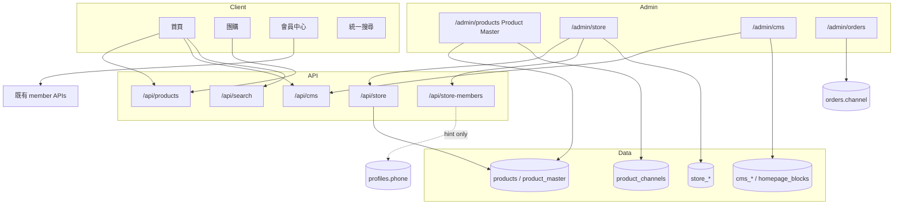

# Phase 5 — 專案架構與後台操作

## 架構圖

## 後台操作說明

### 商品主檔（/admin/products）
1. 商品只建立一次
2. 以 `channels` / `publish_website` / `publish_group_buy` / `publish_store` 控制渠道
3. 官網售價／團購售價／建議售價分欄維護

### 門市管理（/admin/store）
1. **門市會員**：只填電話（+編號／備註）；若提示「找到相同電話」→ 人工處理，系統不合併
2. **效期／批號／異常／退貨／報廢／訂購**：皆關聯 `products.id`
3. **Export**：下載 JSON（inventory + batches）

### 統一 CMS（/admin/cms）
1. 調整首頁區塊顯示與排序
2. 新增 CMS 頁面草稿
3. Banner 列表（`cms_banners`）

### 訂單中心（/admin/orders）
1. 以渠道篩選 Website / Group Buy / Store Reservation
2. 既有狀態／信件／匯出流程不變

## 效能與安全（本階段落點）
- Next Image / Server Components：沿用既有模式；首頁區塊可後續改 RSC
- RLS：新表皆啟用
- Audit：商品／門市／CMS 寫入 logAudit
- Rate limit：沿用 Phase 4 `src/lib/security/rateLimit.ts`
