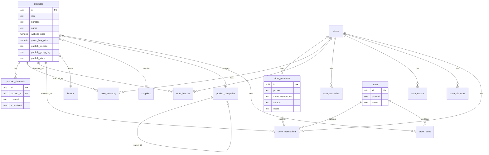
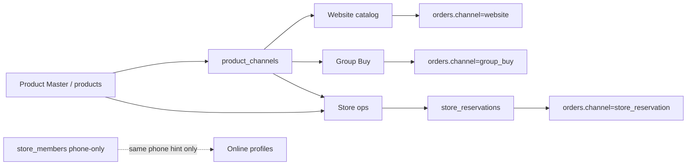

# Phase 5 — Database ER（精簡）

```mermaid
erDiagram
  products ||--o{ product_channels : has
  products ||--o{ store_inventory : stocked_as
  products ||--o{ store_batches : batched_as
  products ||--o{ store_reservations : reserved_as
  products }o--|| brands : brand
  products }o--|| suppliers : supplier
  product_categories ||--o{ product_categories : parent_id
  products }o--o| product_categories : category
  stores ||--o{ store_members : has
  stores ||--o{ store_inventory : has
  stores ||--o{ store_batches : has
  stores ||--o{ store_anomalies : has
  stores ||--o{ store_returns : has
  stores ||--o{ store_disposals : has
  stores ||--o{ store_reservations : has
  store_members ||--o{ store_reservations : optional
  orders ||--o{ store_reservations : optional
  products ||--o{ order_items : line
  orders ||--o{ order_items : contains

  products {
    uuid id PK
    text sku
    text barcode
    text name
    numeric website_price
    numeric group_buy_price
    bool publish_website
    bool publish_group_buy
    bool publish_store
  }

  product_channels {
    uuid id PK
    uuid product_id FK
    text channel
    bool is_enabled
  }

  store_members {
    uuid id PK
    text phone
    text store_member_no
    text source
    text notes
  }

  orders {
    uuid id PK
    text channel
    text status
  }
```

## 資料流（官網／團購／門市）

```mermaid
flowchart LR
  PM[Product Master / products]
  CH[product_channels]
  WEB[Website catalog]
  GB[Group Buy]
  ST[Store ops]
  SM[store_members phone-only]
  OM[Online profiles]

  PM --> CH
  CH --> WEB
  CH --> GB
  CH --> ST
  PM --> ST
  SM -.->|same phone hint only| OM
  ST --> RES[store_reservations]
  RES --> ORD[orders.channel=store_reservation]
  WEB --> ORD2[orders.channel=website]
  GB --> ORD3[orders.channel=group_buy]
```
